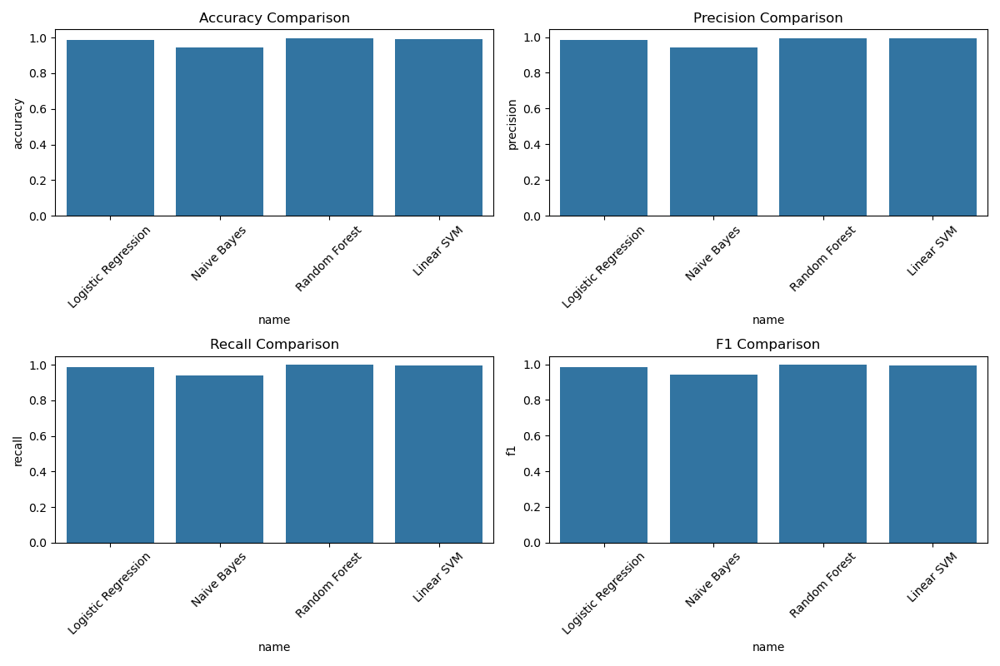

# Fake News Detection

An end-to-end machine learning project for detecting fake news articles using natural language processing and classification techniques.

## Project Overview

This project aims to build and evaluate machine learning models for fake news detection. Using the "Fake and Real News Dataset" from Kaggle, we implement a complete pipeline from data preprocessing to model evaluation and deployment.



## Dataset

The dataset used in this project is the "Fake and Real News Dataset" from Kaggle, which contains:

- Thousands of labeled articles from reliable and unreliable sources
- Headlines, article text, and publication information
- Binary classification (real vs. fake)

## Project Structure

```
fake_news_detection/
├── data/                      # Dataset storage (dataset from kaggle, both fake and true news dataset)
├── notebooks/                 # Jupyter notebooks for exploration and end-to-end ml-models
├── src/                       # Source code (Needs some refinements, see the notebook code for fully working model)
│   ├── data_processing.py     # Data loading and preprocessing
│   ├── feature_engineering.py # Feature extraction
│   ├── models.py              # ML models implementation
│   ├── evaluation.py          # Metrics and evaluation
│   └── utils.py               # Helper functions
├── models/                    # Saved trained models (we currently our one best performing model)
├── results/                   # Results and visualizations
├── app/                       # Demo application (Still needs some fixes, might crash down due to some minor bugs)
├── requirements.txt           # Dependencies
└── README.md                  # Project documentation
```

## Features

- **Data preprocessing**: Text cleaning, tokenization, and normalization
- **Feature extraction**: TF-IDF vectorization with n-grams
- **Multiple models**: Logistic Regression, Random Forest, SVM, and Naive Bayes
- **Comprehensive evaluation**: Accuracy, precision, recall, F1 score
- **Feature importance analysis**: Understanding the most indicative terms
- **Misclassification analysis**: Examining difficult cases
- **Interactive demo app**: Test the model on custom text

## Model Performance

Our best performing model achieves:

- Accuracy: ~XX%
- Precision: ~XX%
- Recall: ~XX%
- F1 Score: ~XX%


## Key Findings

- [Your findings about linguistic patterns in fake vs. real news]
- Key indicators of fake news include [...]
- Real news articles tend to exhibit [...]
- [Other interesting observations]

## Usage

### Setup

1. Clone the repository:

```
git clone https://github.com/your-username/fake-news-detection.git
cd fake-news-detection
```

2. Install dependencies:

```
pip install -r requirements.txt
```

3. Download the dataset from Kaggle and place it in the `data/` directory.

### Running the Pipeline

1. Process the data:

```
python src/data_processing.py
```

2. Train and evaluate models:

```
python src/models.py
```

3. Analyze feature importance:

```
python src/feature_engineering.py
```

### Demo Application

Run the Streamlit app:

```
cd app
streamlit run app.py
```

## Future Improvements

- Incorporate more advanced NLP techniques (word embeddings, transformers)
- Add more features (sentiment analysis, readability metrics)
- Implement ensemble methods for improved accuracy
- Expand the dataset with more diverse sources
- Deploy the model as a browser extension

## Requirements

- Python 3.8+
- scikit-learn
- pandas
- numpy
- matplotlib
- seaborn
- nltk
- streamlit
- wordcloud

## Author

[Your Name]

## License

This project is licensed under the MIT License - see the LICENSE file for details.

## Acknowledgments

- Kaggle for providing the dataset
- [Your instructor/course name]
- [Any other acknowledgments]
